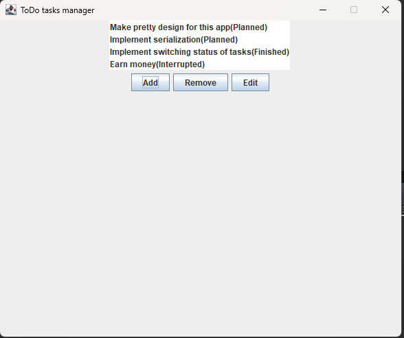

# To do tasks manager
## Usage example

# What can it do?
1. Add/edit or remove TODO tasks
## Not implemented yet, but in process 
2. Notifies you of planned tasks
2. Switch status of tasks - Planned, Finished, Interrupted, Delayed
3. Set time limits for your tasks - when it starts and when it ends
4. Automaticly switches status of task with time limit
5. Saves all of your tasks to JSON files, you'll never lose it